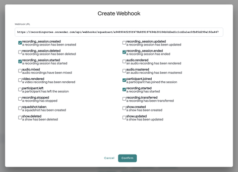

# Integrations

You can automate session creation and the running state of the session timer by sending HTTP POST requests to Recording Notes. Endpoints require token authentication.

## Authentication

All integration requests must include the `RECNOTES_AUTH_API_TOKEN` (set in `settings.conf` or environment variables). If `RECNOTES_AUTH_API_TOKEN` is not explicitly set, it is auto-generated from your `RECNOTES_AUTH_USERNAME` and `RECNOTES_AUTH_PASSWORD`. The token is printed to the console during startup of the server.

## SquadCast Webhooks

**Endpoint:** `POST /api/webhooks/squadcast/<token>`

Handles recording session events. Set this URL in your [SquadCast developer settings](https://app.squadcast.fm/account/developers).





| Event | Action |
|---|---|
| `recording_session.created` | Creates a new session |
| `participant.joined` | Creates a new session (fallback if "created" event was missed) |
| `recording.started` | Marks session as `active`, sets `started_at`, begins the timer |
| `recording.stopped` | Marks session as `completed`, sets `stopped_at`, stops the timer |

Example payload (`recording_session.created`):

```json
{
  "name": "recording_session.created",
  "sessionID": "sq-1234567890",
  "sessionTitle": "My Podcast Episode 42"
}
```

## Triggers API

**Endpoint:** `POST /api/triggers`

Control sessions directly from any HTTP client (Bitfocus Companion, scripts, etc.).

| Action | Body Fields | Description |
|---|---|---|
| `create` | `name` (required) | Create a new session |
| `start` | `id` (required) | Mark an existing session as active |
| `start` | `instant: true`, `name` (optional) | Create and start a session in one call |
| `stop` | `id` (required) | Mark an existing session as completed |
| `add_note` | `id` (required), `text` (required) | Add a timestamped note to an existing session |

### Examples

```bash
# Create a session
curl -X POST "http://localhost:3000/api/triggers?token=YOUR_TOKEN" \
  -H "Content-Type: application/json" \
  -d '{"action":"create","name":"My Session"}'
# → {"id":1}

# Instant session (create + start)
curl -X POST "http://localhost:3000/api/triggers?token=YOUR_TOKEN" \
  -H "Content-Type: application/json" \
  -d '{"action":"start","instant":true,"name":"My Session"}'
# → {"status":"started","id":2}

# Start an existing session
curl -X POST "http://localhost:3000/api/triggers?token=YOUR_TOKEN" \
  -H "Content-Type: application/json" \
  -d '{"action":"start","id":1}'
# → {"status":"started","id":"1"}

# Stop the session
curl -X POST "http://localhost:3000/api/triggers?token=YOUR_TOKEN" \
  -H "Content-Type: application/json" \
  -d '{"action":"stop","id":1}'
# → {"status":"stopped","id":"1"}

# Add a note
curl -X POST "http://localhost:3000/api/triggers?token=YOUR_TOKEN" \
  -H "Content-Type: application/json" \
  -d '{"action":"add_note","id":1,"text":"Great point about latency"}'
# → {"id":1,"status":"created"}
```
