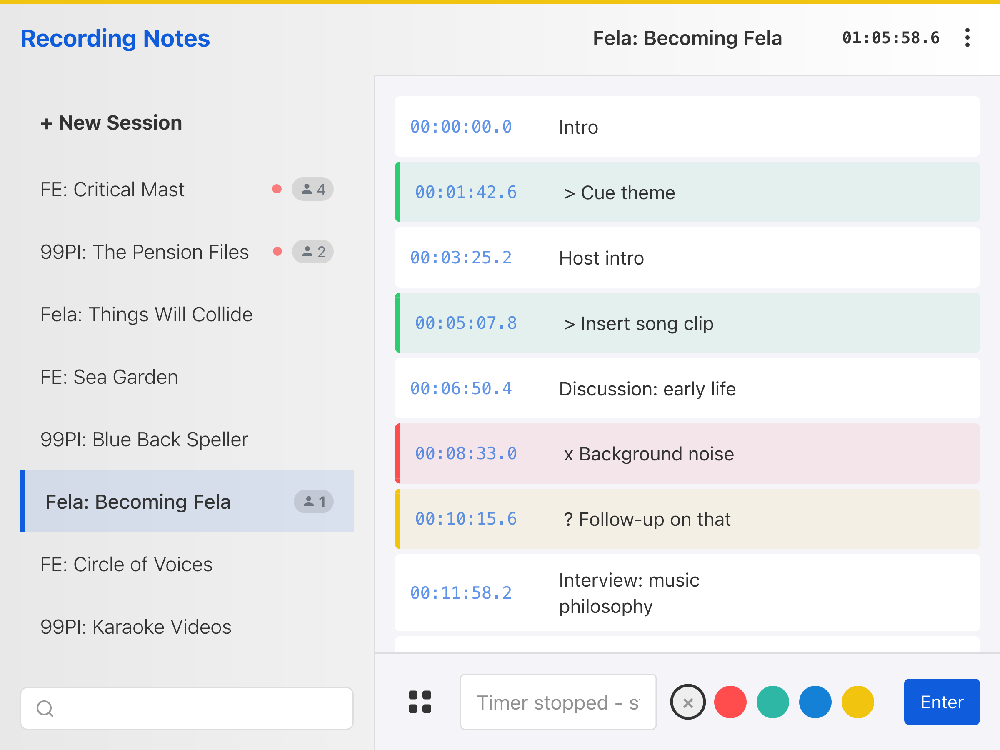
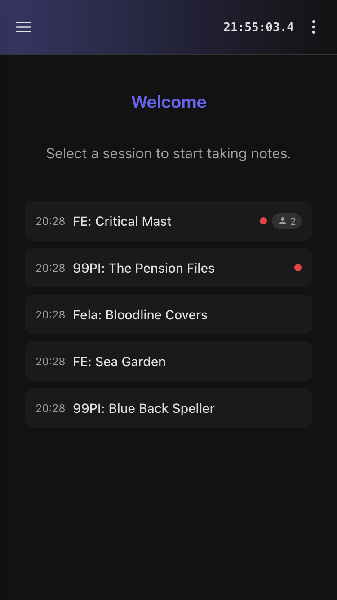
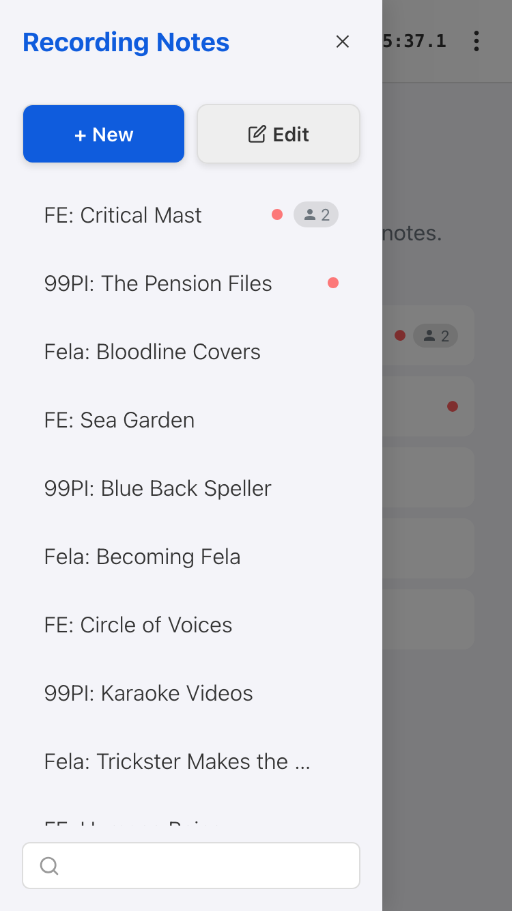
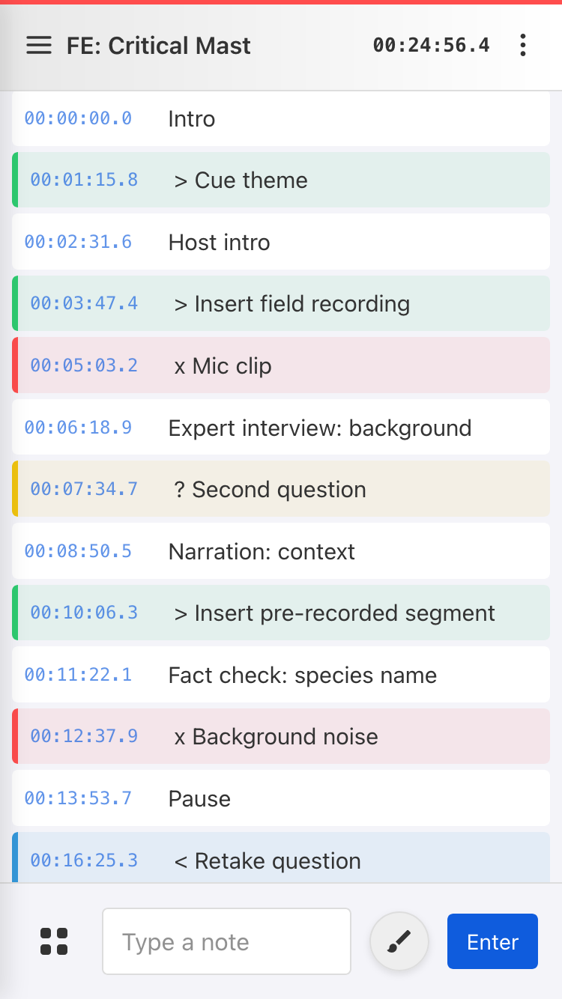
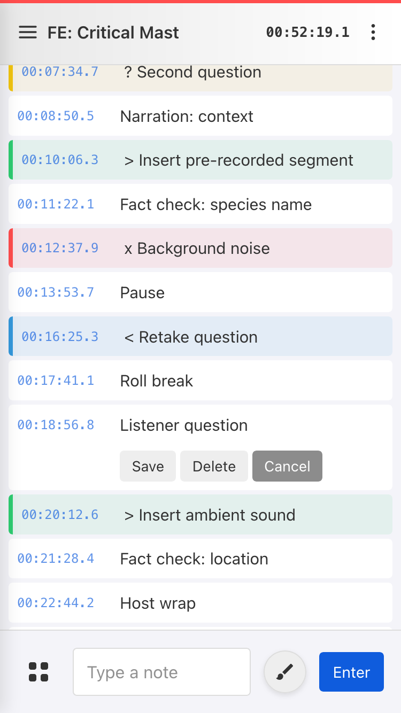
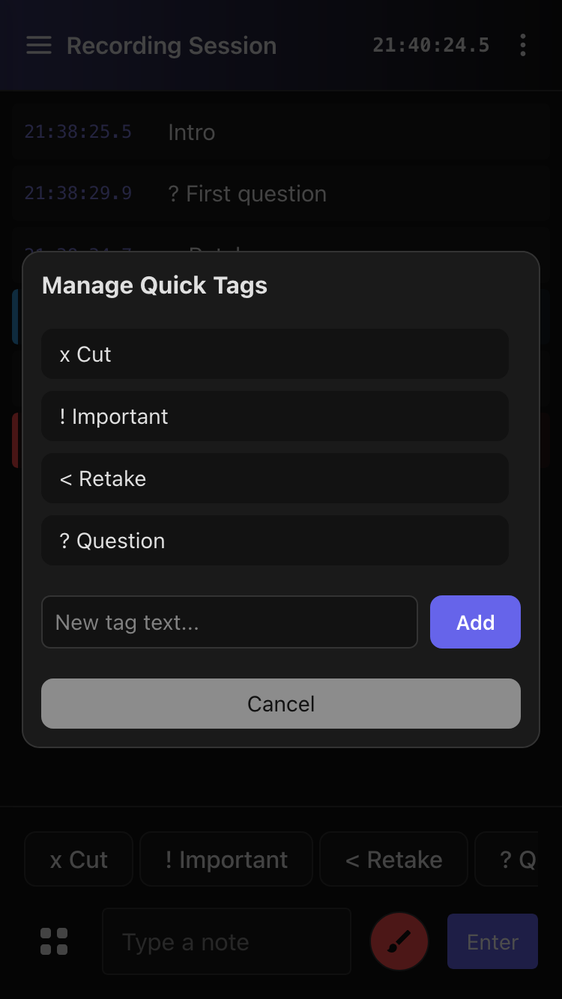
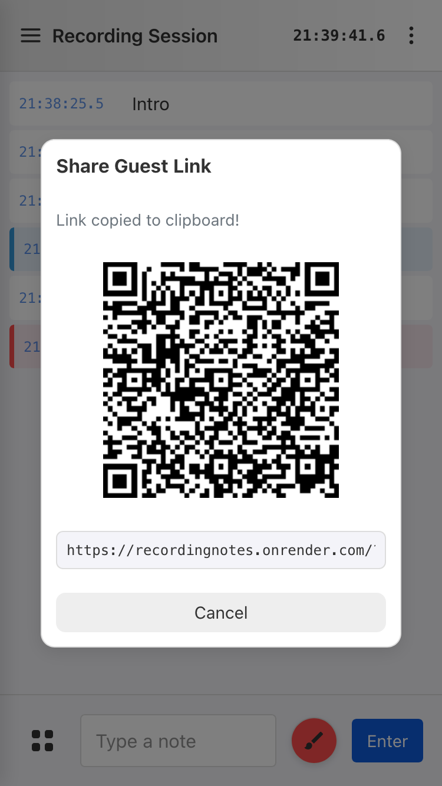
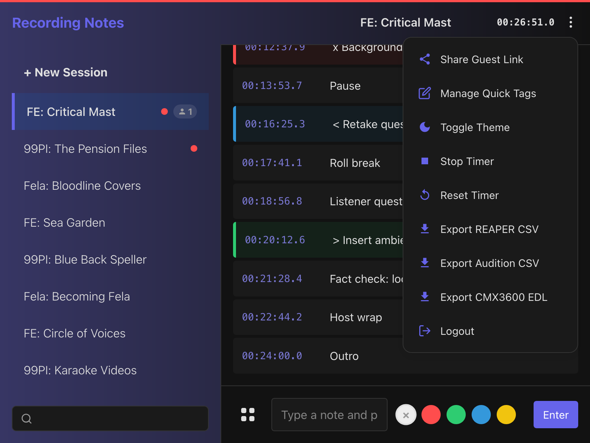
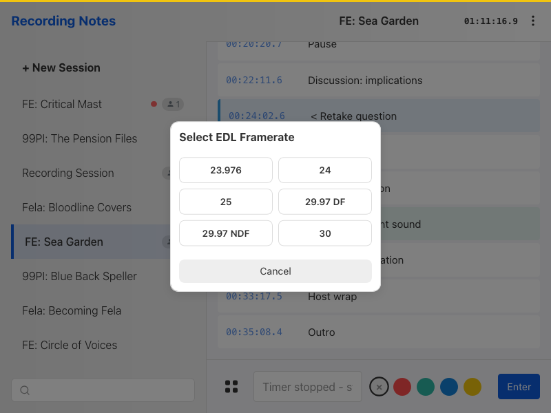

# User Guide

## Getting Started

Open `http://localhost:3000` in your browser. If authentication is configured, you'll be prompted to log in.

**Mobile home screen (no session selected):**

## Sessions

A notes session relates to a recording. From the sidebar you can:

- **Create** a new session with a name
- **Switch** between sessions by clicking them
- **Edit** session names by clicking the hover button or long pressing on mobile
- **Delete** sessions (removes all included notes)

Sessions can be in one two timestamp modes:

- **Clock mode** - notes use the current time-of-day (HH:MM:SS)
- **Timer mode** - notes use time relative to when the timer started. Supports multi-run timers (pause/resume across multiple takes).

Manually created sessions default to clock mode, but can be run in timer mode by clicking "Start Timer" in the overflow menu (⋮). Sessions created through [integrations](integrations.md) are always in timer mode, as their start and stop is designed to be triggered automatically.

## Taking Notes

Notes can be typed into the input box and commited with the Enter button. The timestamp is frozen as soon as the the first letter of a note is typed.

Notes can be:

- **Edited or Deleted** by clicking on the hover button or long pressing on mobile
- **Color-coded** using the color picker

Quick Tags are customizable shortcuts for commonly used notes like "Cut" or "Retake", and can be changed in the overflow menu (⋮).

## Guest Access

A shareable guest link can be generated for a session from the overflow menu (⋮). The link is automatically copied to the clipboard, and a QR code and URL are displayed:

Guests can:

- View and add or edit notes to that session
- Start and stop the timer
- Export notes for editing the recording afterwards

Guests cannot access other sessions.

## Export

Once finished recording, the recording notes can be exported for use in editing software. Open the overflow menu (⋮) in the header to access export options:

- **REAPER** - CSV with timeline markers
- **Audition** - CSV with timeline markers
- **Resolve** - CMX3600 EDL format (select framerate from modal)

Exported timestamps use the timezone configured in `RECNOTES_EXPORT_TIMEZONE` (default: `UTC`).
